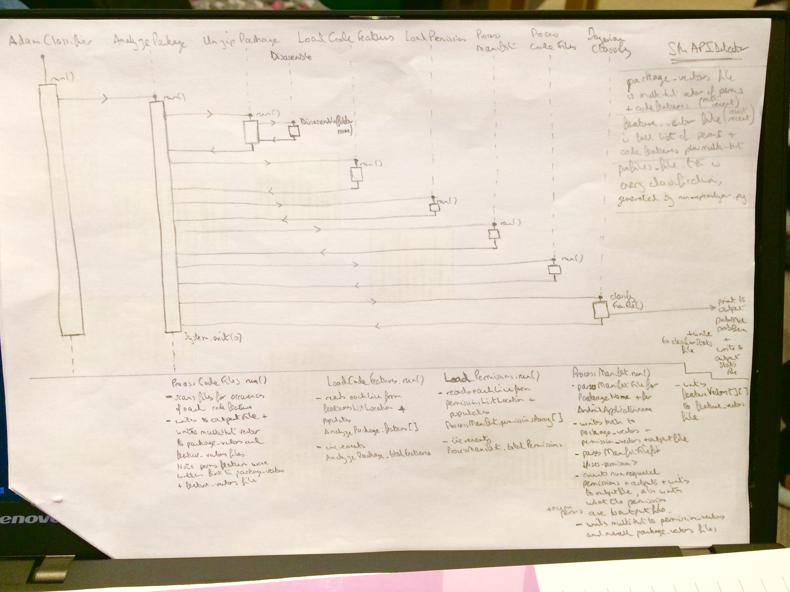

Sequence Diagrams
-----------------
I find these are really useful and aren't too hard to get to grips with.  They are great for figuring out exactly what the flow of your code is, or needs to be.  Sequence diagrams have loads of info about messages passed back and forth, when objects are instantiated and so on.  Recently I had to take someone else's four-year old code which, with the greatest of respect, was quite opaque and hard to understand.  Here is a hand-drawn sequence diagram I made, which is quite simple since I was sketching it out myself quicky:

<>
