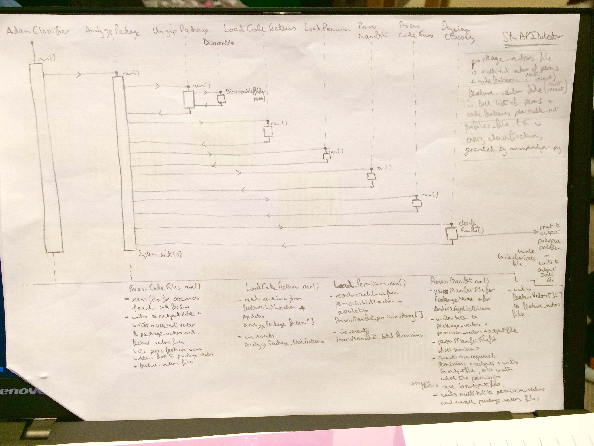

Sequence Diagrams
-----------------
I find these are really useful and aren't too hard to get to grips with.  They are great for figuring out exactly what the flow of your code is, or needs to be.  Sequence diagrams have loads of info about messages passed back and forth, when objects are instantiated and so on.  Recently I had to take someone else's four-year old code which, with the greatest of respect, was quite opaque and hard to understand.  

Here is a hand-drawn sequence diagram I made, which is quite simple since I was sketching it out myself quicky:

Along the top are the classes involved, and it is read from left to right, with the whole timeline running from top to bottom.  Starting at AdamClassifier, we can see run() is called, which instantiates AnalyzePackage, where a different run() is also called.  This instantiates UnzipPackage, within whose run() method Disassemble is instantiated.  And so on and so forth.  I left a lot of detail off this sequence diagram as it just for me to get a grip of what was happening.  

Next, we can see a much more formal and complicated example of mine (for a different piece of software):

Arguably this is easier to follow as it contains more information.  Regardless of which you prefer, I do recommend using these as it helps crystallise in your own head what is going on and is good to show other team members when talking about what you are doing, or if you have to give some code to someone else who has no idea what is happening!  Give them a go, hand-draw one first, then you can use a tool like MS Visio or similar to formalise them.
